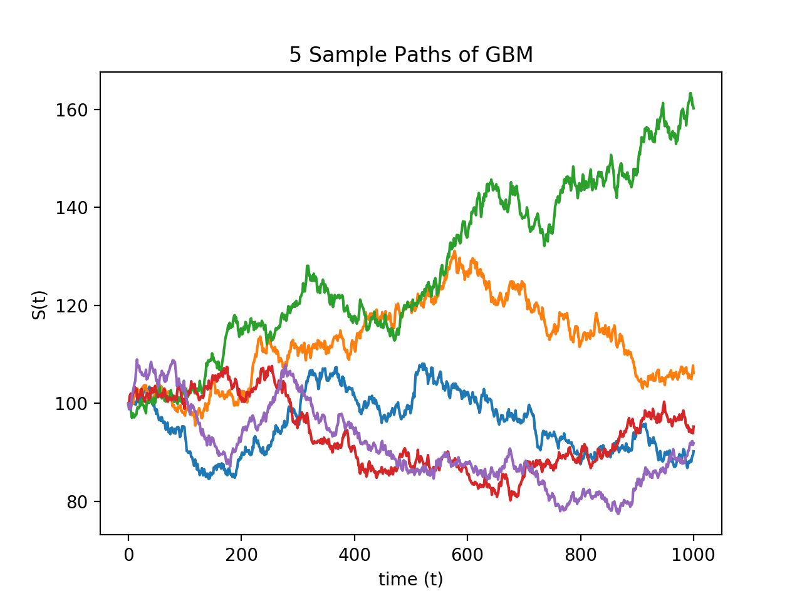

### Description

This README is intended to guide the user in how to use the GBM simulation module.

The README is written in Markdown, and is much easier to read on GitHub:

https://github.com/DavisVaughan/uncc-math-6204/tree/master/assignments/hw-02

### General

* Author   - Davis Vaughan

* Date     - 9/14/2017

* Homework - 02

### Purpose

The purpose of this module is to generate 5 sample paths from Geometric Brownian Motion
and plot them.

### Numerical methods used 

Euler discretization of the SDE was used to simulate the sample paths. 

### Included files

`main.py`         - (DRIVER) a demo of the GBM functions using the parameters set in the HW-2 pdf.

`gbm_simulator.py` - the functions that generate the stock price simulations

### How to run 

Because the main.py file includes the code:

```python
if __name__ == "__main__":
    print(main())
```

the easiest way to run the example is from the terminal.

Within your command line / terminal, navigate to the folder containing the main.py script, and just run:

```bash
python2 main.py
```

^ Make sure you are using python2.

A plot will pop up first with the 5 paths. It should look like this:



and once you close the plot a numpy array
will be printed to the console that looks like this:

```python
[[ 100.           98.90085115   99.12261664 ...,   93.91266709
    94.04627793   94.8434251 ]
 [ 100.           99.87413578   99.45404644 ...,  111.85655913
   113.25968725  111.69621742]
 [ 100.           99.97117588   99.64703562 ...,  169.08802541
   169.10987245  168.48136483]
 [ 100.           99.97277027  101.50454987 ...,   99.12892782
    98.71993264  100.14175903]
 [ 100.           98.82041502   99.38359149 ...,   97.01807704   96.2085316
    96.59288296]]

```
